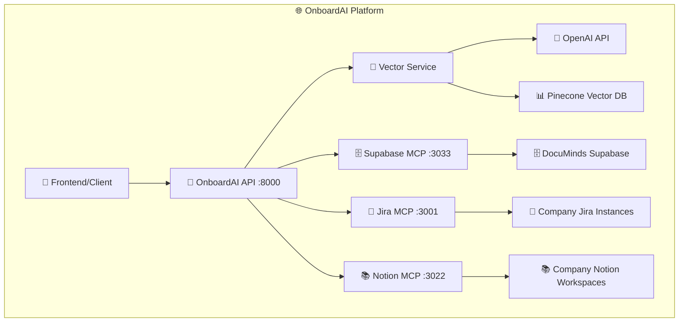

# 🌐 OnboardAI Platform - Повний опис сервісів та ендпоінтів

## 🏗️ Архітектура системи



---

## 🚀 OnboardAI API (Port 8000)

### 📋 Основні ендпоінти

#### 🏥 Health Check
```http
GET /health
```
**Опис:** Перевірка стану всіх сервісів  
**Відповідь:**
```json
{
  "status": "healthy",
  "services": {
    "api": "✅ running",
    "supabase": "✅ connected", 
    "redis": "✅ connected",
    "mcp_jira": "✅ running",
    "mcp_notion": "✅ running",
    "mcp_supabase": "✅ running"
  },
  "timestamp": "2024-01-15T10:30:00Z"
}
```

#### 📖 API Documentation
```http
GET /docs
```
**Опис:** Swagger UI документація  
**Доступ:** http://localhost:8000/docs

#### 🔧 Interactive API
```http
GET /redoc
```
**Опис:** ReDoc інтерактивна документація  
**Доступ:** http://localhost:8000/redoc

---

### 🎯 Onboarding Management

#### 🚀 Створення плану онбордингу
```http
POST /api/v1/onboarding/create
```
**Опис:** Створення персонального плану онбордингу для нового співробітника

**Request Body:**
```json
{
  "name": "Іван Іванов",
  "email": "ivan@techcorp.com",
  "role": "Frontend Developer",
  "department": "Engineering",
  "start_date": "2024-02-01",
  "manager_email": "manager@techcorp.com",
  "skills_required": ["React", "TypeScript", "Node.js"],
  "resources_needed": ["Development Environment", "API Access"]
}
```

**Response:**
```json
{
  "success": true,
  "employee_id": "emp_12345",
  "onboarding_plan": {
    "id": "plan_67890",
    "employee_name": "Іван Іванов",
    "role": "Frontend Developer",
    "department": "Engineering",
    "start_date": "2024-02-01",
    "estimated_duration": "2 weeks",
    "tasks": [
      {
        "id": "task_001",
        "title": "Налаштування розробницького середовища",
        "description": "Встановлення Node.js, React та TypeScript",
        "priority": "high",
        "estimated_time": "4 hours",
        "resources": ["TechCorp Knowledge Base - Setup Guide"]
      }
    ],
    "resources": [
      {
        "id": "res_001",
        "name": "React Development Guide",
        "type": "documentation",
        "source": "Notion",
        "url": "https://techcorp.notion.site/react-guide"
      }
    ],
    "qa_sessions": [
      {
        "id": "qa_001",
        "title": "Знайомство з командою",
        "scheduled_date": "2024-02-02",
        "mentor": "manager@techcorp.com"
      }
    ]
  }
}
```

#### 📊 Отримання прогресу онбордингу
```http
GET /api/v1/progress/{employee_id}
```
**Опис:** Отримання поточного прогресу онбордингу співробітника

**Response:**
```json
{
  "employee_id": "emp_12345",
  "name": "Іван Іванов",
  "role": "Frontend Developer",
  "start_date": "2024-02-01",
  "current_progress": 65,
  "completed_tasks": 13,
  "total_tasks": 20,
  "estimated_completion": "2024-02-15",
  "tasks": [
    {
      "id": "task_001",
      "title": "Налаштування розробницького середовища",
      "status": "completed",
      "completed_at": "2024-02-01T14:30:00Z",
      "time_spent": "3.5 hours"
    },
    {
      "id": "task_002", 
      "title": "Вивчення React компонентів",
      "status": "in_progress",
      "progress": 70,
      "estimated_completion": "2024-02-03"
    }
  ]
}
```

#### ✏️ Оновлення прогресу завдання
```http
POST /api/v1/progress/update
```
**Опис:** Оновлення прогресу конкретного завдання

**Request Body:**
```json
{
  "task_id": "task_002",
  "employee_id": "emp_12345",
  "status": "completed",
  "time_spent": "2.5 hours",
  "notes": "Успішно завершено вивчення React компонентів"
}
```

---

### 🗄️ DocuMinds Integration

#### 📚 Отримання ресурсів з DocuMinds
```http
GET /api/v1/documinds/resources
```
**Опис:** Отримання ресурсів з DocuMinds для конкретної організації

**Query Parameters:**
- `organization_domain` (required): Домен організації (наприклад, "techcorp.com")
- `integration_type` (optional): Тип інтеграції ("notion", "jira", "confluence")
- `limit` (optional): Максимальна кількість ресурсів (default: 50)

**Example:**
```http
GET /api/v1/documinds/resources?organization_domain=techcorp.com&integration_type=notion&limit=20
```

**Response:**
```json
{
  "success": true,
  "organization": {
    "id": "org_techcorp_uuid",
    "name": "TechCorp",
    "domain": "techcorp.com",
    "plan": "enterprise"
  },
  "integration": {
    "id": "int_notion_uuid",
    "type": "notion",
    "name": "TechCorp Knowledge Base",
    "status": "connected"
  },
  "resources": [
    {
      "id": "res_001",
      "name": "React Development Guide",
      "type": "page",
      "url": "https://techcorp.notion.site/react-guide",
      "last_synced_at": "2024-01-15T09:00:00Z",
      "status": "active"
    },
    {
      "id": "res_002",
      "name": "API Documentation",
      "type": "database",
      "url": "https://techcorp.notion.site/api-docs",
      "last_synced_at": "2024-01-15T08:30:00Z",
      "status": "active"
    }
  ],
  "total_count": 15
}
```

#### 🔗 Список інтеграцій DocuMinds
```http
GET /api/v1/documinds/integrations
```
**Опис:** Отримання доступних інтеграцій організації

**Query Parameters:**
- `organization_domain` (required): Домен організації

**Response:**
```json
{
  "success": true,
  "organization": {
    "id": "org_techcorp_uuid",
    "name": "TechCorp",
    "domain": "techcorp.com"
  },
  "integrations": [
    {
      "id": "int_notion_uuid",
      "type": "notion",
      "name": "TechCorp Knowledge Base",
      "status": "connected",
      "last_sync_at": "2024-01-15T09:00:00Z"
    },
    {
      "id": "int_jira_uuid",
      "type": "jira",
      "name": "TechCorp Project Management",
      "status": "connected",
      "last_sync_at": "2024-01-15T08:45:00Z"
    }
  ]
}
```

---

### 🤔 Q&A System

#### 💬 Q&A система
```http
GET /api/v1/qa/answer
```
**Опис:** Отримання відповіді на запитання з бази знань

**Query Parameters:**
- `question` (required): Питання співробітника
- `role` (optional): Роль співробітника (default: "general")

**Example:**
```http
GET /api/v1/qa/answer?question=Як налаштувати розробницьке середовище?&role=Frontend Developer
```

**Response:**
```json
{
  "question": "Як налаштувати розробницьке середовище?",
  "role": "Frontend Developer",
  "answer": "Для налаштування розробницького середовища в TechCorp:\n\n1. Встановіть Node.js та npm\n2. Клонуйте репозиторій проекту\n3. Встановіть залежності: npm install\n4. Налаштуйте React та TypeScript\n5. Підключіться до корпоративного VPN\n\nДетальна інструкція доступна в TechCorp Knowledge Base.",
  "confidence": 92,
  "context_found": true,
  "sources": [
    {
      "content": "React Development Guide - Setup Section",
      "url": "https://techcorp.notion.site/react-guide",
      "type": "notion"
    },
    {
      "content": "ONBD-001: Development Environment Setup",
      "url": "https://techcorp.atlassian.net/browse/ONBD-001",
      "type": "jira"
    }
  ],
  "relevant_chunks": 3,
  "timestamp": "2024-01-15T10:30:00Z"
}
```

---

### 🧠 AI Vector Engine

#### 🚀 Запуск векторизації корпоративних знань
```http
POST /api/v1/vectorization/start
```
**Опис:** Запуск процесу векторизації всієї корпоративної інформації

**Response:**
```json
{
  "success": true,
  "message": "Векторизація повністю завершена!",
  "stats": {
    "total_items": 150,
    "total_chunks": 450,
    "total_vectors": 450
  },
  "vector_index": "onboardai-knowledge-base",
  "processing_time": "5m 23s",
  "timestamp": "2024-01-15T10:30:00Z"
}
```

#### 📊 Статус векторизації
```http
GET /api/v1/vectorization/status
```
**Опис:** Отримання поточного статусу векторної бази знань

**Response:**
```json
{
  "status": "ready",
  "total_vectors": 1250,
  "dimension": 3072,
  "metric": "cosine",
  "index_name": "onboardai-knowledge-base",
  "last_updated": "2024-01-15T10:30:00Z",
  "organizations": [
    {
      "domain": "techcorp.com",
      "vector_count": 450,
      "last_sync": "2024-01-15T09:00:00Z"
    },
    {
      "domain": "financeflow.com", 
      "vector_count": 380,
      "last_sync": "2024-01-15T08:30:00Z"
    }
  ]
}
```

#### 🔍 Семантичний пошук
```http
POST /api/v1/vectorization/semantic-search
```
**Опис:** Виконання семантичного пошуку в векторній базі знань

**Request Body:**
```json
{
  "query": "React компоненти та їх використання",
  "organization_domain": "techcorp.com",
  "limit": 5,
  "min_confidence": 0.7
}
```

**Response:**
```json
{
  "query": "React компоненти та їх використання",
  "organization": "techcorp.com",
  "results": [
    {
      "content": "React компоненти - це основні будівельні блоки React додатків. Кожен компонент є функцією або класом...",
      "source_type": "documentation",
      "source_name": "React Development Guide",
      "url": "https://techcorp.notion.site/react-guide",
      "confidence": 95.2,
      "metadata": {
        "organization": "techcorp.com",
        "type": "documentation",
        "last_updated": "2024-01-10T14:30:00Z"
      }
    }
  ],
  "total_results": 5,
  "search_time": "0.15s"
}
```

#### 🤖 AI контекстуальні відповіді
```http
GET /api/v1/ai/contextual-answer
```
**Опис:** Отримання контекстуальної відповіді від AI помічника

**Query Parameters:**
- `question` (required): Питання співробітника
- `organization_domain` (required): Домен організації
- `role` (optional): Роль співробітника

**Response:**
```json
{
  "question": "Які найкращі практики для React розробки?",
  "organization": "techcorp.com",
  "role": "Frontend Developer",
  "answer": "На основі корпоративних стандартів TechCorp:\n\n1. Використовуйте функціональні компоненти з хуками\n2. TypeScript для типізації\n3. Storybook для компонентів\n4. Jest + Testing Library для тестування\n5. ESLint + Prettier для форматування\n\nДетальні стандарти в TechCorp Knowledge Base.",
  "confidence": 94,
  "context_sources": [
    {
      "content": "React Best Practices Guide",
      "url": "https://techcorp.notion.site/react-best-practices",
      "type": "notion"
    }
  ],
  "ai_model": "gpt-3.5-turbo",
  "processing_time": "1.2s"
}
```

#### 📚 Огляд корпоративних знань
```http
GET /api/v1/ai/knowledge-summary
```
**Опис:** Отримання загального огляду структури корпоративних знань

**Query Parameters:**
- `organization_domain` (optional): Домен організації (якщо не вказано, то для всіх)

**Response:**
```json
{
  "organization": "techcorp.com",
  "summary": {
    "total_documents": 45,
    "total_tasks": 120,
    "total_resources": 25,
    "knowledge_areas": [
      {
        "area": "Frontend Development",
        "document_count": 15,
        "last_updated": "2024-01-15T09:00:00Z",
        "top_topics": ["React", "TypeScript", "CSS", "Testing"]
      },
      {
        "area": "Backend Development", 
        "document_count": 12,
        "last_updated": "2024-01-14T16:30:00Z",
        "top_topics": ["Node.js", "API", "Database", "Security"]
      }
    ],
    "integration_status": {
      "notion": "connected",
      "jira": "connected",
      "confluence": "disconnected"
    },
    "vector_status": {
      "total_vectors": 450,
      "last_vectorization": "2024-01-15T10:30:00Z",
      "coverage": "95%"
    }
  }
}
```

---

## 🗄️ Supabase MCP Server (Port 3033)

### 📋 Основні ендпоінти

#### 🏥 Health Check
```http
GET /health
```
**Опис:** Перевірка стану DocuMinds Supabase MCP сервера

#### 📊 Базова інформація
```http
GET /
```
**Опис:** Інформація про сервер та доступні ендпоінти

#### 🏢 Організації
```http
GET /api/organizations
```
**Опис:** Отримання списку організацій з DocuMinds

**Response:**
```json
{
  "success": true,
  "data": [
    {
      "id": "org_techcorp_uuid",
      "name": "TechCorp",
      "domain": "techcorp.com",
      "plan": "enterprise",
      "status": "active",
      "created_at": "2024-01-01T00:00:00Z"
    }
  ],
  "count": 1,
  "table_info": {
    "name": "organizations",
    "description": "Організації (компанії) в системі DocuMinds",
    "fields": ["id", "name", "domain", "plan", "status"],
    "status": "має дані"
  }
}
```

#### 🔗 Інтеграції організації
```http
GET /api/integrations/{orgId}
```
**Опис:** Отримання інтеграцій для конкретної організації

#### 📚 Ресурси інтеграції
```http
GET /api/resources/{integrationId}
```
**Опис:** Отримання ресурсів для конкретної інтеграції

#### 🗄️ Аналіз структури бази даних
```http
GET /api/database-info
```
**Опис:** Детальний аналіз структури бази даних DocuMinds

**Response:**
```json
{
  "success": true,
  "supabase_url": "https://rbmepcfznvcskxayuisp.supabase.co",
  "analysis": "Аналіз структури бази даних DocuMinds",
  "total_tables_checked": 10,
  "tables_exist": 10,
  "tables_with_data": 3,
  "table_details": [
    {
      "name": "organizations",
      "exists": true,
      "status": "таблиця існує",
      "record_count": 5,
      "schema_ready": true
    },
    {
      "name": "integrations",
      "exists": true,
      "status": "таблиця існує", 
      "record_count": 12,
      "schema_ready": true
    }
  ]
}
```

---

## 🎯 Jira MCP Server (Port 3001)

### 📋 Основні ендпоінти

#### 🏥 Health Check
```http
GET /health
```
**Опис:** Перевірка стану Jira MCP сервера

#### 📊 Базова інформація
```http
GET /
```
**Опис:** Інформація про сервер та конфігурацію

#### 🎯 Задачі онбордингу
```http
GET /api/onboarding-tasks
```
**Опис:** Отримання задач онбордингу з Jira

**Query Parameters:**
- `project_key` (optional): Ключ проекту (default: "ONBD")
- `assignee` (optional): Email призначеного співробітника

**Response:**
```json
{
  "success": true,
  "project": "ONBD",
  "tasks": [
    {
      "id": "ONBD-001",
      "summary": "Налаштування розробницького середовища",
      "description": "Встановлення Node.js, React та TypeScript",
      "status": "To Do",
      "assignee": "ivan@techcorp.com",
      "priority": "High",
      "created": "2024-01-15T09:00:00Z",
      "due_date": "2024-01-17T18:00:00Z"
    }
  ],
  "total_count": 15
}
```

#### 📝 Створення задачі онбордингу
```http
POST /api/onboarding-tasks
```
**Опис:** Створення нової задачі онбордингу в Jira

**Request Body:**
```json
{
  "summary": "Вивчення React компонентів",
  "description": "Ознайомлення з основними React компонентами та їх використанням",
  "assignee": "ivan@techcorp.com",
  "priority": "Medium",
  "due_date": "2024-01-20T18:00:00Z"
}
```

#### 📊 Статистика проектів
```http
GET /api/projects/stats
```
**Опис:** Отримання статистики по проектах онбордингу

---

## 📚 Notion MCP Server (Port 3022)

### 📋 Основні ендпоінти

#### 🏥 Health Check
```http
GET /health
```
**Опис:** Перевірка стану Notion MCP сервера

#### 📊 Базова інформація
```http
GET /
```
**Опис:** Інформація про сервер та конфігурацію

#### 📚 Ресурси онбордингу
```http
GET /api/onboarding-resources
```
**Опис:** Отримання ресурсів онбордингу з Notion

**Query Parameters:**
- `database_id` (optional): ID бази даних Notion
- `role` (optional): Роль співробітника для фільтрації

**Response:**
```json
{
  "success": true,
  "database": "onboarding-resources",
  "resources": [
    {
      "id": "page_001",
      "title": "React Development Guide",
      "url": "https://techcorp.notion.site/react-guide",
      "type": "page",
      "last_edited": "2024-01-15T09:00:00Z",
      "tags": ["frontend", "react", "development"],
      "content_preview": "Цей гайд описує основи розробки на React..."
    }
  ],
  "total_count": 25
}
```

#### 🔍 Пошук в Notion
```http
POST /api/search
```
**Опис:** Пошук контенту в Notion workspace

**Request Body:**
```json
{
  "query": "React компоненти",
  "filter": {
    "property": "type",
    "value": "page"
  },
  "limit": 10
}
```

#### 📝 Створення сторінки онбордингу
```http
POST /api/pages
```
**Опис:** Створення нової сторінки онбордингу в Notion

---

## 🔧 Конфігурація та налаштування

### 📁 Environment Variables

#### 🚀 OnboardAI API (.env)
```bash
# DocuMinds Supabase (єдиний джерело правди)
SUPABASE_URL=https://rbmepcfznvcskxayuisp.supabase.co
SUPABASE_ANON_KEY=eyJhbGciOiJIUzI1NiIsInR5cCI6IkpXVCJ9...

# AI та Vector сервіси (глобальні)
OPENAI_API_KEY=sk-your-openai-key
PINECONE_API_KEY=your-pinecone-key
PINECONE_ENVIRONMENT=us-east-1-aws
PINECONE_INDEX_NAME=onboardai-knowledge-base

# Налаштування векторізації
EMBEDDING_MODEL=text-embedding-3-large
CHUNK_SIZE=1000
CHUNK_OVERLAP=200
MAX_TOKENS=4000

# Розробка
DEBUG=true

# ❌ НЕ МАЄ глобальних кредитів до Jira/Notion!
# Кредити отримуються ДИНАМІЧНО з DocuMinds integration_credentials
```

#### 🗄️ Supabase MCP Server
```bash
SUPABASE_URL=https://rbmepcfznvcskxayuisp.supabase.co
SUPABASE_ANON_KEY=eyJhbGciOiJIUzI1NiIsInR5cCI6IkpXVCJ9...
SUPABASE_PROJECT_ID=rbmepcfznvcskxayuisp
PORT=3000
```

#### 🎯 Jira MCP Server
```bash
PORT=3001
# Кредити отримуються динамічно з DocuMinds
```

#### 📚 Notion MCP Server
```bash
PORT=3022
# Кредити отримуються динамічно з DocuMinds
```

---

## 🚀 Запуск системи

### 🐳 Docker Compose
```bash
# Запуск всіх сервісів
./start.sh

# Або вручну
docker-compose up -d
```

### 📊 Перевірка стану
```bash
# Перевірка всіх сервісів
node test-services.js

# Перевірка конкретного сервісу
curl http://localhost:8000/health
curl http://localhost:3033/health
curl http://localhost:3001/health
curl http://localhost:3022/health
```

---

## 🎯 Приклади використання

### 👤 Сценарій: Новий співробітник TechCorp

1. **Створення плану онбордингу:**
```bash
curl -X POST http://localhost:8000/api/v1/onboarding/create \
  -H "Content-Type: application/json" \
  -d '{
    "name": "Іван Іванов",
    "email": "ivan@techcorp.com",
    "role": "Frontend Developer",
    "department": "Engineering",
    "start_date": "2024-02-01",
    "manager_email": "manager@techcorp.com",
    "skills_required": ["React", "TypeScript"],
    "resources_needed": ["Development Environment"]
  }'
```

2. **Отримання ресурсів з DocuMinds:**
```bash
curl "http://localhost:8000/api/v1/documinds/resources?organization_domain=techcorp.com&integration_type=notion"
```

3. **Запитання до AI помічника:**
```bash
curl "http://localhost:8000/api/v1/qa/answer?question=Як налаштувати розробницьке середовище?&role=Frontend Developer"
```

4. **Векторизація корпоративних знань:**
```bash
curl -X POST http://localhost:8000/api/v1/vectorization/start
```

---

## 🛡️ Безпека та архітектура

### 🔐 Динамічні кредити
- AI агент НЕ має глобальних кредитів до Jira/Notion
- Кредити отримуються ДИНАМІЧНО з DocuMinds для кожної компанії
- Повна ізоляція даних між організаціями

### 🏢 Multi-tenant архітектура
- Кожна компанія має власні інтеграції та кредити
- Контекстуальна векторизація з метаданими організації
- Compliance з корпоративними політиками безпеки

### 📊 Моніторинг та аудит
- Всі запити логуються в audit_logs
- Відстеження доступу до ресурсів
- Health checks для всіх сервісів

---

## 🎉 Готовність до production

✅ **Enterprise-ready архітектура**  
✅ **Multi-tenant безпека**  
✅ **Динамічне управління кредитами**  
✅ **AI Vector Engine з Pinecone**  
✅ **Повна інтеграція з DocuMinds**  
✅ **Swagger документація**  
✅ **Docker контейнеризація**  
✅ **Health checks та моніторинг**

**🚀 Готово для демонстрації інвесторам як revolutionary AI-powered onboarding platform!**
