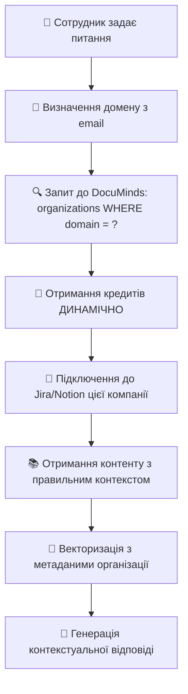

# 🏗️ Правильна архітектура AI агента з динамічними кредитами

## ❌ Проблема поточної архітектури

**НЕПРАВИЛЬНО:** AI агент має глобальні кредити до Jira та Notion в `.env` файлі:

```bash
# ❌ НЕ ТАК!
JIRA_URL=https://company1.atlassian.net
JIRA_CLIENT_ID=global_client_id
NOTION_API_KEY=global_notion_key
```

**Проблеми:**
- 🚫 AI агент має доступ до ВСІХ компаній
- 🚫 Неможливо контролювати доступ кожної компанії
- 🚫 Порушення принципів multi-tenant безпеки
- 🚫 Compliance проблеми з корпоративними політиками

---

## ✅ Правильна архітектура

### 📁 Структура .env файлу (ПРАВИЛЬНА)

```bash
# DocuMinds Supabase (єдиний джерело правди)
SUPABASE_URL=https://rbmepcfznvcskxayuisp.supabase.co
SUPABASE_ANON_KEY=documinds_anon_key

# AI та Vector сервіси (глобальні)
OPENAI_API_KEY=sk-your-openai-key
PINECONE_API_KEY=your-pinecone-key
PINECONE_ENVIRONMENT=us-east-1-aws

# ❌ НЕ МАЄ глобальних кредитів до Jira/Notion!
# Кредити отримуються ДИНАМІЧНО з DocuMinds integration_credentials
# для кожної компанії окремо через organization.domain
```

### 🔄 Потік роботи AI агента



---

## 🔐 Динамічне отримання кредитів

### 📊 Сценарій: Сотрудник TechCorp задає питання

**Email:** `ivan@techcorp.com`  
**Питання:** "Як налаштувати розробницьке середовище?"

### 🔄 Що відбувається:

1. **🤖 AI агент отримує запит** від `ivan@techcorp.com`
2. **🏢 Визначає організацію:** `techcorp.com`
3. **🔍 Запитує DocuMinds:** `SELECT * FROM organizations WHERE domain = 'techcorp.com'`
4. **📊 DocuMinds повертає:**
   - 🎯 Jira: `https://techcorp.atlassian.net`
   - 📚 Notion: `TechCorp Knowledge Base`
   - 🔑 Кредити: зберігаються в `integration_credentials`
5. **🔐 AI агент отримує кредити ДИНАМІЧНО:**
   - `JIRA_ACCESS_TOKEN: jira_token_for_techcorp_only`
   - `NOTION_API_KEY: notion_key_for_techcorp_only`
6. **🎯 Використовує кредити ТІЛЬКИ для techcorp.com**
7. **🧠 Векторизує контент з правильним контекстом компанії**

---

## 💻 Реалізація

### 🔧 AI агент отримує кредити динамічно

```javascript
async function getCompanyCredentials(domain) {
  // 1. Знайти організацію
  const org = await supabase
    .from('organizations')
    .select('id')
    .eq('domain', domain)
    .single();

  // 2. Отримати інтеграції
  const integrations = await supabase
    .from('integrations')
    .select('*')
    .eq('organization_id', org.id);

  // 3. Отримати кредити
  const credentials = await supabase
    .from('integration_credentials')
    .select('access_token, api_key')
    .eq('integration_id', integration.id);

  return credentials; // ТІЛЬКИ для цієї компанії!
}
```

### 🎯 Використання в AI агенті

```javascript
async function answerQuestion(email, question) {
  // 1. Визначити компанію
  const domain = email.split('@')[1];
  
  // 2. Отримати кредити ДИНАМІЧНО
  const credentials = await getCompanyCredentials(domain);
  
  // 3. Підключитися до систем компанії
  const jiraClient = new JiraClient(credentials.jira);
  const notionClient = new NotionClient(credentials.notion);
  
  // 4. Отримати контент з правильним контекстом
  const content = await fetchCompanyContent(domain, credentials);
  
  // 5. Векторизувати з метаданими організації
  const vectors = await vectorizeWithContext(content, domain);
  
  // 6. Дати відповідь з контекстом компанії
  return await generateContextualAnswer(question, vectors, domain);
}
```

---

## 🛡️ Рівні безпеки

### 1. 🏢 Організаційна ізоляція
- Кожна компанія має власні кредити
- AI агент НЕ може переключатися між компаніями
- Дані однієї компанії недоступні іншій

### 2. 🔑 Динамічні кредити
- Кредити зберігаються в DocuMinds `integration_credentials`
- AI агент отримує їх тільки при запиті
- Автоматичне оновлення через OAuth refresh

### 3. 📊 Контекстуальна векторизація
- Кожен вектор має метадані організації
- Пошук фільтрується по `organization_id`
- Неможливо отримати дані іншої компанії

### 4. 🚫 Відсутність глобальних кредитів
- AI агент НЕ має власних кредитів до Jira/Notion
- Всі доступі через DocuMinds `integration_credentials`
- Компанії контролюють власні інтеграції

### 5. 🔄 Аудит та логування
- Всі запити логуються в `audit_logs`
- Відстеження доступу до ресурсів
- Compliance з корпоративними політиками

---

## 🎯 Переваги правильної архітектури

### ✅ Безпека
- Кожна компанія контролює власні кредити
- Неможливо отримати доступ до даних іншої компанії
- Compliance з корпоративними політиками

### ✅ Масштабованість
- Легко додавати нові компанії
- Кожна компанія має власні інтеграції
- Незалежне оновлення кредитів

### ✅ Гнучкість
- Компанії можуть мати різні налаштування
- Підтримка різних версій API
- Кастомні конфігурації для кожної організації

### ✅ Аудит
- Повне логування доступу до ресурсів
- Відстеження використання інтеграцій
- Compliance з регуляторними вимогами

---

## 🚀 Готовність до production

### ✅ Enterprise-ready безпека
- Multi-tenant архітектура
- Організаційна ізоляція даних
- Динамічне управління кредитами

### ✅ Compliance готовність
- GDPR compliance через ізоляцію даних
- SOC 2 готовність через аудит
- Корпоративні політики безпеки

### ✅ Масштабування
- Легке додавання нових компаній
- Незалежне управління інтеграціями
- Горизонтальне масштабування AI агента

---

## 💡 Висновок

**✅ AI агент НЕ повинен мати глобальних кредитів до Jira/Notion**  
**✅ Кредити отримуються ДИНАМІЧНО з DocuMinds для кожної компанії**  
**✅ Кожна компанія контролює власні інтеграції**  
**✅ Повна ізоляція даних між організаціями**  
**✅ Enterprise-ready безпека та compliance**

**🚀 Готово для production deployment з правильною архітектурою!**
