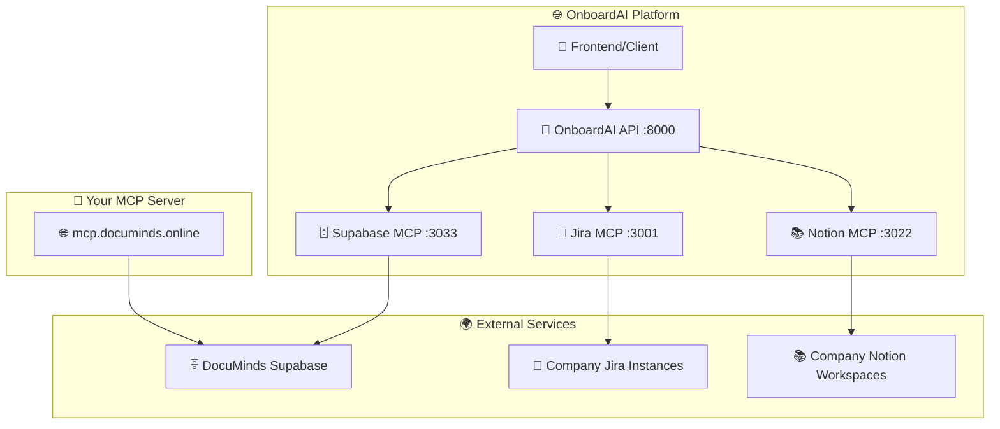

# 🔗 MCP Сервери - Повний гід використання

## 🌐 **Ваш MCP сервер:** https://mcp.documinds.online/

---

## 🏗️ **Архітектура MCP серверів**



---

## 🗄️ **Supabase MCP Server (Port 3033)**

### 📋 **Основні ендпоінти:**

#### 🏥 Health Check
```http
GET /health
```
**Опис:** Перевірка стану DocuMinds Supabase MCP сервера

#### 📊 Базова інформація
```http
GET /
```
**Опис:** Інформація про сервер та доступні ендпоінти

#### 🏢 Організації
```http
GET /api/organizations
```
**Опис:** Отримання списку організацій з DocuMinds

**Response:**
```json
{
  "success": true,
  "data": [
    {
      "id": "org_techcorp_uuid",
      "name": "TechCorp",
      "domain": "techcorp.com",
      "plan": "enterprise",
      "status": "active",
      "created_at": "2024-01-01T00:00:00Z"
    }
  ],
  "count": 1,
  "table_info": {
    "name": "organizations",
    "description": "Організації (компанії) в системі DocuMinds",
    "fields": ["id", "name", "domain", "plan", "status"],
    "status": "має дані"
  }
}
```

#### 🔗 Інтеграції організації
```http
GET /api/integrations/{orgId}
```
**Опис:** Отримання інтеграцій для конкретної організації

**Example:**
```bash
curl "http://localhost:3033/api/integrations/org_techcorp_uuid"
```

#### 📚 Ресурси інтеграції
```http
GET /api/resources/{integrationId}
```
**Опис:** Отримання ресурсів для конкретної інтеграції

#### 🗄️ Аналіз структури бази даних
```http
GET /api/database-info
```
**Опис:** Детальний аналіз структури бази даних DocuMinds

---

## 🎯 **Jira MCP Server (Port 3001)**

### 📋 **Основні ендпоінти:**

#### 🏥 Health Check
```http
GET /health
```

#### 🎯 Задачі онбордингу
```http
GET /api/onboarding-tasks
```
**Query Parameters:**
- `project_key` (optional): Ключ проекту (default: "ONBD")
- `assignee` (optional): Email призначеного співробітника

**Example:**
```bash
curl "http://localhost:3001/api/onboarding-tasks?project_key=ONBD&assignee=ivan@techcorp.com"
```

#### 📝 Створення задачі онбордингу
```http
POST /api/onboarding-tasks
```
**Request Body:**
```json
{
  "summary": "Вивчення React компонентів",
  "description": "Ознайомлення з основними React компонентами та їх використанням",
  "assignee": "ivan@techcorp.com",
  "priority": "Medium",
  "due_date": "2024-01-20T18:00:00Z"
}
```

#### 📊 Статистика проектів
```http
GET /api/projects/stats
```

---

## 📚 **Notion MCP Server (Port 3022)**

### 📋 **Основні ендпоінти:**

#### 🏥 Health Check
```http
GET /health
```

#### 📚 Ресурси онбордингу
```http
GET /api/onboarding-resources
```
**Query Parameters:**
- `database_id` (optional): ID бази даних Notion
- `role` (optional): Роль співробітника для фільтрації

#### 🔍 Пошук в Notion
```http
POST /api/search
```
**Request Body:**
```json
{
  "query": "React компоненти",
  "filter": {
    "property": "type",
    "value": "page"
  },
  "limit": 10
}
```

#### 📝 Створення сторінки онбордингу
```http
POST /api/pages
```

---

## 🔧 **Як використовувати MCP сервери**

### 1. 🚀 **Запуск всіх сервісів**

```bash
# Автоматичний запуск
./start.sh

# Або вручну
docker-compose up -d
```

### 2. 🔍 **Перевірка стану**

```bash
# Перевірка всіх сервісів
node test-services.js

# Перевірка конкретного сервісу
curl http://localhost:3033/health  # Supabase MCP
curl http://localhost:3001/health  # Jira MCP
curl http://localhost:3022/health  # Notion MCP
```

### 3. 🎯 **Використання через OnboardAI API**

#### 📚 Отримання ресурсів з DocuMinds
```bash
curl "http://localhost:8000/api/v1/documinds/resources?organization_domain=techcorp.com&integration_type=notion"
```

#### 🎯 Створення задачі в Jira
```bash
curl -X POST http://localhost:8000/api/v1/onboarding/create \
  -H "Content-Type: application/json" \
  -d '{
    "name": "Іван Іванов",
    "email": "ivan@techcorp.com",
    "role": "Frontend Developer",
    "department": "Engineering",
    "start_date": "2024-02-01",
    "manager_email": "manager@techcorp.com",
    "skills_required": ["React", "TypeScript"],
    "resources_needed": ["Development Environment"]
  }'
```

### 4. 🔗 **Пряме використання MCP серверів**

#### 🗄️ Supabase MCP
```bash
# Отримання організацій
curl "http://localhost:3033/api/organizations"

# Аналіз бази даних
curl "http://localhost:3033/api/database-info"

# Інтеграції організації
curl "http://localhost:3033/api/integrations/org_techcorp_uuid"
```

#### 🎯 Jira MCP
```bash
# Задачі онбордингу
curl "http://localhost:3001/api/onboarding-tasks"

# Статистика проектів
curl "http://localhost:3001/api/projects/stats"
```

#### 📚 Notion MCP
```bash
# Ресурси онбордингу
curl "http://localhost:3022/api/onboarding-resources"

# Пошук в Notion
curl -X POST http://localhost:3022/api/search \
  -H "Content-Type: application/json" \
  -d '{"query": "React компоненти", "limit": 5}'
```

---

## 🌐 **Ваш MCP сервер: mcp.documinds.online**

### 🔗 **Як підключитися:**

1. **🌐 Прямий доступ:**
   ```bash
   curl "https://mcp.documinds.online/api/organizations"
   curl "https://mcp.documinds.online/api/database-info"
   ```

2. **🔧 В OnboardAI API:**
   ```python
   # В main.py змініть URL
   MCP_SUPABASE_HOST = "https://mcp.documinds.online"
   ```

3. **🐳 В Docker Compose:**
   ```yaml
   environment:
     - MCP_SUPABASE_HOST=https://mcp.documinds.online
   ```

### 📊 **Тестування вашого MCP сервера:**

```bash
# Створення тестового скрипта
cat > test_mcp_documinds.js << 'EOF'
const axios = require('axios');

async function testMCPDocuMinds() {
  const baseUrl = 'https://mcp.documinds.online';
  
  console.log('🧪 Тестування MCP DocuMinds сервера');
  console.log(`🔗 URL: ${baseUrl}`);
  
  try {
    // Health check
    console.log('\n🏥 Health Check:');
    const health = await axios.get(`${baseUrl}/health`);
    console.log(`✅ Status: ${health.status}`);
    console.log(`📝 Response: ${JSON.stringify(health.data)}`);
    
    // Organizations
    console.log('\n🏢 Organizations:');
    const orgs = await axios.get(`${baseUrl}/api/organizations`);
    console.log(`✅ Status: ${orgs.status}`);
    console.log(`📊 Count: ${orgs.data.count}`);
    console.log(`📝 Data: ${JSON.stringify(orgs.data.data, null, 2)}`);
    
    // Database info
    console.log('\n🗄️ Database Info:');
    const dbInfo = await axios.get(`${baseUrl}/api/database-info`);
    console.log(`✅ Status: ${dbInfo.status}`);
    console.log(`📊 Tables: ${dbInfo.data.total_tables_checked}`);
    console.log(`📝 Details: ${JSON.stringify(dbInfo.data.table_details, null, 2)}`);
    
  } catch (error) {
    console.error('❌ Error:', error.message);
    if (error.response) {
      console.error('📊 Status:', error.response.status);
      console.error('📝 Response:', error.response.data);
    }
  }
}

testMCPDocuMinds();
EOF

# Запуск тесту
node test_mcp_documinds.js
```

---

## 🎯 **Практичні приклади використання**

### 👤 **Сценарій: Новий співробітник TechCorp**

1. **🔍 Отримання інформації про організацію:**
   ```bash
   curl "https://mcp.documinds.online/api/organizations" | jq '.data[] | select(.domain=="techcorp.com")'
   ```

2. **🔗 Отримання інтеграцій:**
   ```bash
   curl "https://mcp.documinds.online/api/integrations/org_techcorp_uuid"
   ```

3. **📚 Отримання ресурсів:**
   ```bash
   curl "https://mcp.documinds.online/api/resources/integration_notion_uuid"
   ```

4. **🎯 Створення задачі в Jira:**
   ```bash
   curl -X POST http://localhost:3001/api/onboarding-tasks \
     -H "Content-Type: application/json" \
     -d '{
       "summary": "Налаштування розробницького середовища",
       "assignee": "ivan@techcorp.com",
       "priority": "High"
     }'
   ```

### 🤖 **Інтеграція з AI агентом:**

```python
# В OnboardAI API
async def get_company_resources(domain: str):
    # 1. Отримати організацію з DocuMinds
    org_response = await httpx.get(f"https://mcp.documinds.online/api/organizations")
    org = next((o for o in org_response.json()['data'] if o['domain'] == domain), None)
    
    if not org:
        return []
    
    # 2. Отримати інтеграції
    integrations_response = await httpx.get(f"https://mcp.documinds.online/api/integrations/{org['id']}")
    
    # 3. Отримати ресурси для кожної інтеграції
    resources = []
    for integration in integrations_response.json()['data']:
        resources_response = await httpx.get(f"https://mcp.documinds.online/api/resources/{integration['id']}")
        resources.extend(resources_response.json()['data'])
    
    return resources
```

---

## 🚀 **Готово для використання!**

✅ **MCP сервери налаштовані та готові**  
✅ **Ваш сервер доступний на mcp.documinds.online**  
✅ **Повна інтеграція з OnboardAI платформою**  
✅ **Динамічні кредити з DocuMinds**  
✅ **Multi-tenant архітектура**  

**🎉 Тепер можете використовувати всі MCP сервери для повноцінної роботи з корпоративними системами!**
