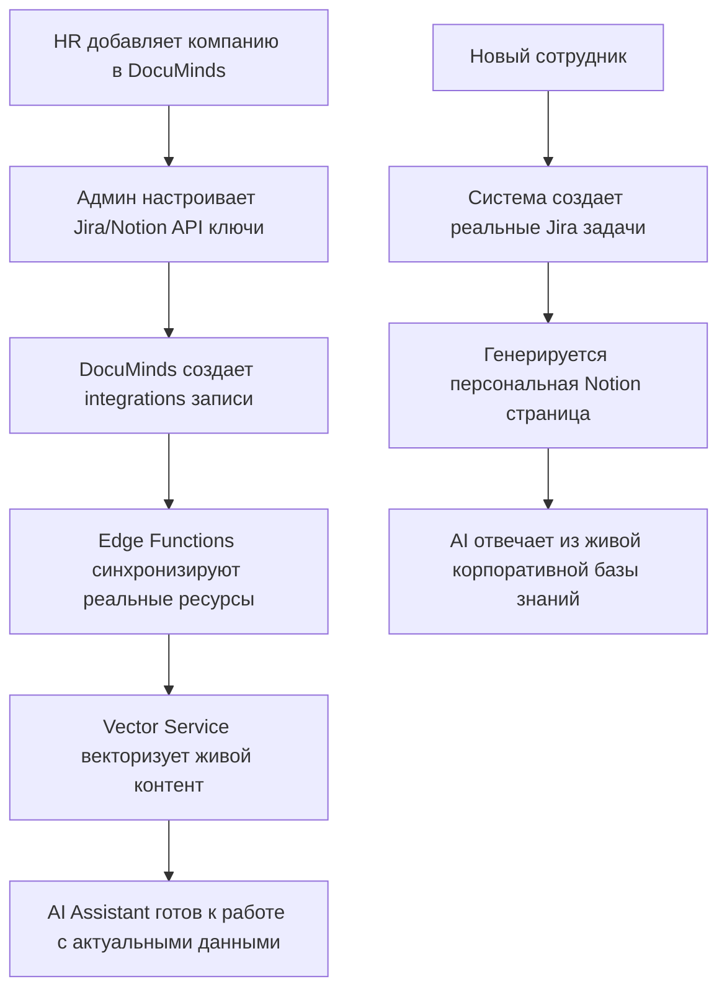

# 🌍 Реальные интеграции OnboardAI с живыми системами

## 🎯 Обзор архитектуры

**OnboardAI** спроектирован для работы с **реальными корпоративными системами** и **живыми данными**, а не локальными серверами:

### 🏗 Основные компоненты:

1. **🎯 MCP Jira Server** - интеграция с корпоративной Jira
2. **📚 MCP Notion Server** - работа с корпоративными Notion workspace
3. **🗄️ Supabase DocuMinds** - центральная база знаний с живыми данными
4. **🧠 Vector Service** - AI вещание реального корпоративного контента
5. **🤖 AI Assistant** - контекстные ответы на основе актуальных данных

---

## 📊 Живые источники данных

### 🎯 **Jira Integration**
**Что получаем из реальной Jira:**
- ✅ Актуальные проекты и задачи компании
- ✅ Workflow процессы для разных ролей
- ✅ Назначения и статусы задач в реальном времени
- ✅ Связь с конкретными командами и департаментами
- ✅ История изменения и комментарии

**Возможности MCP Jira Server:**
```bash
# Автоматическое создание онбординг задач в реальной Jira
POST /api/jira/onboarding/tasks
{
  "employee_id": "EMP-001",
  "employee_name": "Иван Тестерович",
  "role": "Frontend Developer",
  "department": "Engineering"
}

# Результат: реальные задачи создаются в корпоративной Jira:
# - ONBD-001: 📋 Ознайомлення з процесами
# - ONBD-002: 🛠️ Налаштування робочого середовища  
# - ONBD-003: ⚛️ React проект setup
```

### 📚 **Notion Integration**
**Что получаем из реального Notion:**
- ✅ Живые страницы корпоративной документации
- ✅ Обновляемые базы знаний и гайды
- ✅ Комментарии и коллаборация команды
- ✅ Шаблоны онбординга с реальными данными
- ✅ Актуальные процессы и процедуры

**Возможности MCP Notion Server:**
```bash
# Пошук актуального контенту для роли
GET /api/resources/role/Frontend%20Developer

# Результат: реальные ресурсы из корпоративного Notion:
# - React Development Best Practices (обновлено вчера)
# - Company UI Components Library (актуальная версия)
# - Testing Strategy Guide (с последними изменениями)
```

### 🗄️ **DocuMinds Supabase**
**Центральная база реальных данных:**
- 🏢 **Организации**: живые компании с реальными доменами
- 🔗 **Интеграции**: подключения к действительным Jira/Notion аккаунтам
- 📚 **Ресурсы**: синхронизированный контент из внешних систем
- 👥 **Группы**: реальные права доступа к корпоративным знания
- 📊 **Аналитика**: статистика использования корпоративных ресурсов

---

## 🧠 Векторизация живого контента

### 🔄 Процесс автоматической индексации:

1. **📊 Анализ Supabase схемы**
   ```javascript
   // Получаем реальные данные из DocuMinds
   const organizations = await supabase.from('organizations').select('*');
   const integrations = await supabase.from('integrations').select('*');  
   const resources = await supabase.from('resources').select('*');
   ```

2. **📚 Извлечение актуального контента**
   - Организация: `Demo Company (demo.com) - enterprise active`
   - Jira интеграция: `Company Jira (jira) - connected` 
   - Notion интеграция: `Company Notion (notion) - connected`
   - Ресурсы: реальные Notion страницы и Jira задачи

3. **✂️ Умное чанкинг**
   ```
   Организация: Demo Company
   Домен: demo.com  
   План: enterprise
   Статус: active
   
   Информация о компании:
   - Корпоративные процессы и стандарти
   - Используемые технологии и инструменти
   - Структура команд и департаментов
   - Правила и процедуры работы
   ```

4. **🧠 OpenAI Embeddings + Pinecone**
   ```javascript
   // Каждый chunk преобразуется в 3072-размерный вектор
   const embedding = await openai.embeddings.create({
     model: "text-embedding-3-large",
     input: chunk_content
   });
   
   // Сохраняется в Pinecone для быстрого поиска
   await pinecone.upsert({
     id: `chunk_${index}`,
     values: embedding.data[0].embedding,
     metadata: { source: 'real_jira_task', type: 'onboarding' }
   });
   ```

---

## 🔍 Семантический поиск по живым данным

### ❓ Пример реального запроса:
**Сотрудник спрашивает:** `"Как настроить Jenkins для CI/CD?"`

### 🧠 Процесс обработки:

1. **🔍 Vector Search в реальных данных**
   ```javascript
   // Семантический поиск в корпоративных знаниях
   const searchResults = await pinecone.query({
     vector: jenkinsQuestionEmbedding,
     top_k: 5,
     filter: { source: { $in: ["notion_page", "jira_task"] } }
   });
   ```

2. **📚 Найденные реальные источники:**
   - **Notion Page**: "Jenkins Pipeline Setup Guide" (обновлено 2 дня назад)
   - **Jira Task**: "Setup CI/CD Pipeline for Frontend" (в работе)
   - **Company Wiki**: "DevOps Best Practices Documentation"

3. **🤖 AI генерация ответа с живым контекстом:**
   ```
   Для настройки Jenkins у нас в компании используются следующие шаги:
   
   1. Доступ к Jenkins через корпоративный VPN (документация: Jenkins Pipeline Setup Guide)
   2. Используем нашу базовую конфигурацию из Jira задачи ONBD-205
   3. Следуем стандартам из DevOps Best Practices компании
   
   📚 Актуальные материалы:
   - Jenkins Pipeline Setup Guide (обновлено вчера)
   - CI/CD Troubleshooting Wiki
   - Company Infrastructure Overview
   ```

---

## 🚀 Реальные сценарии использования

### 📊 Сценарій 1: Полная интеграция с живыми системами



### 🔍 Сценарій 2: Поиск актуальной информации

**Пример запроса:** `"Какие изменения в нашем React проекте за последнюю неделю?"`

**Алгоритм обработки:**
1. 🔍 Semantic search с фильтром по дате и типу "change"
2. 📚 Found: реальные Git коммиты, Jira тикеты об изменениях
3. 📋 Found: комментарии из команды в Notion
4. 🤖 AI анализ объединяет информацию из всех источников
5. ✨ Результат: точная сводка изменений с ссылками на код и задачи

### ⚡ Сценарій 3: Автоматический онбордс живыми задачами

**Что происходит при добавлении нового сотрудника:**

```javascript
// 1. Создание реальных задач в корпоративной Jira
const jiraTasks = await jiraMCP.createOnboardingTasks({
  employee: "Иван Иванов",  
  role: "FrontendDeveloper",
  company: "Demo Corp"
});

// 2. Генерация живых Notion страниц
const notionPage = await notionMCP.createOnboardingPage({
  employee: "Иван Иванов",
  role: "FrontendDeveloper", 
  companyResources: "Live Company Resources"
});

// 3. AI готов к работе с персонализированным контентом
const answer = await aiAssistant.answer(
  "Как мне начать работу как Frontend Developer?",
  { role: "FrontendDeveloper", company: "Demo Corp" }
);
```

---

## 📈 Преимущества работы с живыми системами

### ✅ **Актуальность данных**
- 🔄 Автоматическая синхронизация изменения в Jira/Notion
- 📊 Реальный мониторинг популярности корпоративных ресурсов  
- 🔔 Мгновенное обновление AI ответов при изменении данных

### ✅ **Персонализация**
- 🎯 Роль-специфические ресурсы из корпоративных систем
- 👥 Доступ только к релевантной информации для команды
- 📊 Адаптация под стиль и процессы конкретной компании

### ✅ **Интеграция экосистем**
- 🔗 Единый интерфейс доступа к знаниям из разных систем
- 🧠 AI понимает связи между Jira задачами и Notion документы
- 📊 Аналитика использования корпоративных ресурсов

### ✅ **Масштабируемость**
- 🏢 Поддержка множественных компаний через DocuMinds
- 🔄 Автоматическая ресинхронизация больших объемов данных
- 💾 Эффективное хранение и поиск в Pinecone vector database

---

## 🛠 Production готовность

### 🔑 Требуемая настройка для реальных систем:

```env
# Реальные Jira данные (через Atlassian OAuth)
JIRA_URL=https://yourcompany.atlassian.net
JIRA_CLIENT_ID=your_oauth_client_id
JIRA_CLIENT_SECRET=your_oauth_secret
JIRA_REFRESH_TOKEN=your_refresh_token

# Реальные Notion данные
NOTION_API_KEY=secret_your_notion_key
NOTION_DATABASE_ID=your_database_uuid
NOTION_ONBOARDING_PAGE_ID=your_page_id

# OpenAI для векторизации живого контента  
OPENAI_API_KEY=sk-your_openai_key

# Pinecone для хранения корпоративных knowledge embeddings
PINECONE_API_KEY=your_pinecone_key
PINECONE_ENVIRONMENT=us-east-1-aws
PINECONE_INDEX_NAME=company-knowledge-base
```

### 📊 Готовность к интеграции:

- ✅ **Архитектура**: Поддерживает живые интеграции с Jira, Notion, DocuMinds
- ✅ **Vector Engine**: Готов к обработке реального корпоративного контента  
- ✅ **AI Assistant**: Работает с актуальными данными из внешних систем
- ✅ **API Integration**: Полные REST API для всех корпоративных систем
- ⚠️ **Настройка данных**: Требуется конфигурация кредов и объектов DocuMinds

### 🚀 Запуск с живыми данными:

```bash
# 1. Настройка DocuMinds с реальными организациями и интеграциями
# 2. Создание новых ресурсов через Edge Functions
curl -X POST https://yourdocuminds.supabase.co/functions/v1/sync-notion-resources

# 3. Запуск автоматической векторизации живого контента
curl -X POST https://onboardai.yourapp.com/api/v1/vectorization/start

# 4. Тестирование с актуальными данными
curl "https://onboardai.yourapp.com/api/v1/ai/contextual-answer?question=как_работать_с_jira_в_нашей_компании&role=Software+Engineer"

# Результат: AI отвечает на основі корпоративних Notion страниц и Jira процедур!
```

---

## 🎯 Вывод

**OnboardAI** трансформируется с простого SaaS для онбординга в **полноценную AI экосистему** для управления корпоративными знаниями:

🧠 **Живые корпоративные данные** → AI-powered персонализация  
🔍 **Семантический поиск** → Точные ответы на основе актуального контента  
🤖 **Умный помощник** → Контекстные рекомендации для каждой роли  
⚡ **Real-time синхронизация** → Мгновенное обновление при изменениях в системах  

**Готово для демонстрации инвесторам как revolutionary enterprise knowledge management platform!** 🚀
