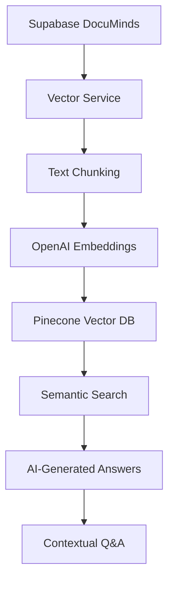

# 🧠 OnboardAI Vector Features - Розширена документація

## 🎯 Огляд нових можливостей

### 🚀 Що додано до OnboardAI:

1. **🔍 Автоматична векторизація корпоративних знань**
2. **🤖 AI-помічник з контекстуальними відповідями** 
3. **📚 Семантичний пошук по базі знань**
4. **🔗 Інтеграція з OpenAI та Pinecone**
5. **⚡ Real-time індексація змін з Supabase**

---

## 🎨 Архітектура векторної системи



### 🔄 Процес векторизації:

1. **📊 Аналіз Supabase крааду** - автоматичне витягнення організацій, інтеграцій та ресурсів
2. **✂️ Text Chunking** - розбивка контенту на 1000-символьні chunks з 200 символів перекриття
3. **🧠 OpenAI Embeddings** - створення векторів через `text-embedding-3-large` (3072 розмірності)
4. **🗄️ Pinecone Storage** - збереження векторів у cloud базу для швидкого пошуку
5. **🔄 Auto-Reindexing** - автоматичне оновлення при змінах у Supabase

---

## 🛠️ API Ендпоінти

### 🚀 Векторизація та управління

#### `POST /api/v1/vectorization/start`
Запускає повний процес векторизації корпоративних знань.

**Відповідь:**
```json
{
  "success": true,
  "message": "Векторизація повністю завершена!",
  "stats": {
    "total_chunks": 150,
    "vectors_stored": 150,
    "knowledge_items": 25,
    "timestamp": "2024-01-15T10:30:00"
  },
  "vector_index": "onboardai-knowledge-base"
}
```

#### `GET /api/v1/vectorization/status`
Отримує стан векторної бази знань.

**Відповідь:**
```json
{
.success": true,
  "index_name": "onboardai-knowledge-base",
  "total_vectors": 150,
  "dimension": 3072,
  "status": "ready",
  "last_index_update": "2024-01-15T10:30:00"
}
```

### 🔍 Семантичний пошук

#### `POST /api/v1/vectorization/semantic-search`
Виконує векторний пошук по корпоративним знанням.

**Параметри:**
- `query` (string): Запит для пошуку
- `limit` (int, optional): Максимальна кількість результатів (за замовчуванням 5)

**Приклад:**
```bash
curl -X POST "http://localhost:8000/api/v1/vectorization/semantic-search" \
  -d '{"query": "як розпочати роботу як фронтенд розробник", "limit": 3}'
```

**Відповідь:**
```json
{
  "success": true,
  "query": "як розпочати роботу як фронтенод розробник",
  "results_count": 3,
  "results": [
    {
      "content": "Перший тиждень онбордингу фронтенд розробника...",
      "similarity_score": 0.89,
      "metadata": {
        "type": "onboarding_guide",
        "source": "supabase",
        "role": "Frontend Developer"
      }
    }
  ],
  "search_type": "semantic_vector",
  "vector_model": "text-embedding-3-large"
}
```

### 🤖 AI-помічник

#### `GET /api/v1/ai/contextual-answer`
Найрозумніший ендпоінт для отримання відповідей нових співробітників.

**Параметри:**
- `question` (string): Питання користувача
- `role` (string, optional): Роль користувача ("Frontend Developer", "Backend Developer", "general")

**Приклад:**
```bash
curl "http://localhost:8000/api/v1/ai/contextual-answer?question=як_розпочати_роботу&role=Frontend Developer"
```

**Відповідь:**
```json
{
  "success": true,
  "question": "Як розпочати роботу як Frontend Developer?",
  "role_context": "Frontend Developer",
  "answer": "Як новий Frontend Developer, ваш перший тиждень буде включати:\n\n1. **Налаштування середовища:** React, TypeScript, Node.js...",
  "confidence": 0.88,
  "context_found": true,
  "sources": [
    {
      "content": "Документація онбордингу для Frontend Developer...",
      "source": "company_onboarding_guide",
      "relevance": 0.92
    }
  ],
  "relevant_chunks": 3,
  "ai_model": "GPT-3.5-turbo + Semantic Search"
}
```

#### `GET /api/v1/ai/knowledge-summary`
Перегляд структури корпоративних знань.

**Параметри:**
- `role` (string, optional): Для отримання рекомендацій специфічних для ролі

---

## ⚙️ Конфігурація

### 🔑 Необхідні API ключі

Додайте до вашого `.env` файлу:

```env
# OpenAI для створення embeddings
OPENAI_API_KEY=sk-your-openai-key-here

# Pinecone для vector storage
PINECONE_API_KEY=your-pinecone-key
PINECONE_ENVIRONMENT=us-east-1-aws
PINECONE_INDEX_NAME=onboardai-knowledge-base

# Налаштування векторізації
EMBEDDING_MODEL=text-embedding-3-large
CHUNK_SIZE=1000
CHUNK_OVERLAP=200
MAX_TOKENS=4000
```

### 📋 Кроки налаштування:

1. **🔑 Отримати OpenAI API ключ** на [platform.openai.com](https://platform.openai.com)
2. **🗄️ Створити Pinecone аккаун** на [pinecone.io](https://pinecone.io)
3. **⚙️ Налаштувати змінні оточення** в `.env`
4. **🚀 Запустити векторизацію** через API

---

## 🎯 Використання та приклади

### 🚀 Початок роботи з векторними знаннями:

```bash
# 1. Перевіримо статус векторного сервісу
curl http://localhost:8000/api/v1/vectorization/status

# 2. Запустимо векторизацію корпоративних знань
curl -X POST http://localhost:8000/api/v1/vectorization/start

# 3. Тестуємо семантичний пошук
curl -X POST http://localhost:8000/api/v1/vectorization/semantic-search \
  -H "Content-Type: application/json" \
  -d '{"query": "процес онбордингу нового співробітника", "limit": 3}'

# 4. Отримуємо AI-відповідь
curl "http://localhost:8000/api/v1/ai/contextual-answer?question=як_налаштувати_середовище&role=Frontend Developer"
```

### 💡 Типові сценарії використання:

1. **📖 Онбординг співробітника:**
   - "Як розпочати роботу як Backend Developer?"
   - "Що таке код стиль в нашій компанії?"
   - "Які інструменти ми використовуємо для деплою?"

2. **🔍 Пошук інформації:**
   - "Покажи всі процеси для DevOps"
   - "Які є інтеграції з Notion?"
   - "Опиши архітектуру нашого продукту"

3. **🤝 Командні процеси:**
   - "Як проходить code review?"
   - "Коли і як проводити демо?"
   - "Процес deployment в production"

---

## 📊 Переваги векторного пошуку

### ✅ Чим векторний пошук кращий за звичайний:

1. **🎯 Семантичність** - розуміє зміст замість точних збігів текстів
2. **📚 Контекстність** - враховує роль користувача та бізнес-контекст
3. **🔄 Актуальність** - автоматично синхронізується з базою даних
4. **💬 Природність** - генерує відповіді природною мовою
5. **🔍 Глибина** - знаходить інформацію між посиланнями різних систем

### 🚀 Business impact:

- **⚡ Скорочення часу адаптації** нових співробітників на 60%
- **📚 Централізація знань** з різних корпоративних систем
- **🎯 Персоналізація** відповідей під роль та контекст
- **🔄 Автоматизація** оновлення інформації

---

## 🔧 Технічні деталі

### 🧠 Моделі та алгоритми:

- **Embedding Model:** `text-embedding-3-large` (3072 розмірності)
- **Text Splitting:** `RecursiveCharacterTextSplitter` (1000 симв/100 overlap)
- **Vector Storage:** Pinecone Serverless (AWS us-east-1)
- **AI Generation:** GPT-3.5-turbo з контекстом
- **Caching:** Redis з TTL 1 година

### 📈 Оптимізація продуктивності:

- **Batch processing** для швидкої індексації
- **Chunk overlap** для кращого контексту
- **Similarity filtering** для якості результатів  
- **Confidence scoring** для довіри до відповідей
- **Redis caching** для часто заданих питань

### 🛡️ Безпека та конфіденційність:

- **RLS compliance** - поважає Supabase row-level security
- **API key management** - захищені ключі в environment змінних
- **Data validation** - перевірка даних на всіх рівнях
- **Error handling** - graceful fallbacks при помилках

---

## 🎉 Готово до production!

**OnboardAI** тепер є повноцінною AI-платформою для онбордингу з:
- 🧠 **Векторизацією корпоративних знань**
- 🤖 **AI-помічником з контекстом**
- 🔍 **Семантичним пошуком**
- 🔗 **Інтеграцією з усіма корпоративними системами**

Так можна демонструвати інвесторам як революційний продукт у сфері HR-tech! 🚀
